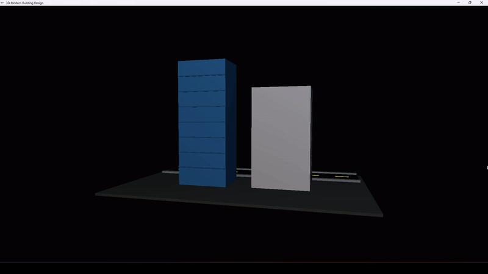

# 3D Building and Road Design

## 🎮 Controls

Use the keyboard to interact with the 3D scene:

| Key | Action |
|-----|--------|
| **A / a** | Rotate scene to the left |
| **D / d** | Rotate scene to the right |
| **W / w** | Zoom in |
| **S / s** | Zoom out |
| **ESC** | Exit the application |

---

### 🧭 Notes

- Click on the output window first to focus it before using controls.
- Rotation is applied around the vertical **Y-axis**.
- Zoom moves the camera forward and backward.
